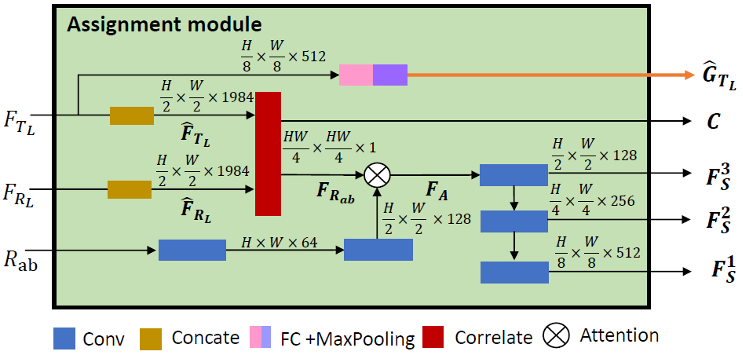
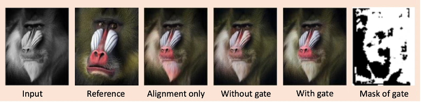
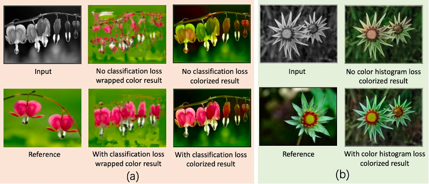

## Gray2ColorNet

This is a release of [Gray2ColorNet: Transfer More Colors from Reference Image](https://dl.acm.org/doi/10.1145/3394171.3413594).

## Pretrained Models

You can download the pretrained model from [https://drive.google.com/file/d/1fgBjqrWLEGiAV60BqMV-LrGKVv_N2uqW/view?usp=sharing](https://drive.google.com/file/d/1fgBjqrWLEGiAV60BqMV-LrGKVv_N2uqW/view?usp=sharing).

Unzip the model weight files and move them to ./checkpoints/imagenet/

### How do I cite Gray2ColorNet?
```
@inproceedings{lu2020gray2colornet,
  title={Gray2ColorNet: Transfer More Colors from Reference Image},
  author={Lu, Peng and Yu, Jinbei and Peng, Xujun and Zhao, Zhaoran and Wang, Xiaojie},
  booktitle={Proceedings of the 28th ACM International Conference on Multimedia},
  pages={3210--3218},
  year={2020}
}
```

If we submit the paper to a conference or journal, we will update the BibTeX.

### Contact information

For help or issues using Gray2ColorNet, please submit a GitHub issue.

For personal communication related to Gray2ColorNet, please contact Peng Lu (lupeng@bupt.edu.cn).







